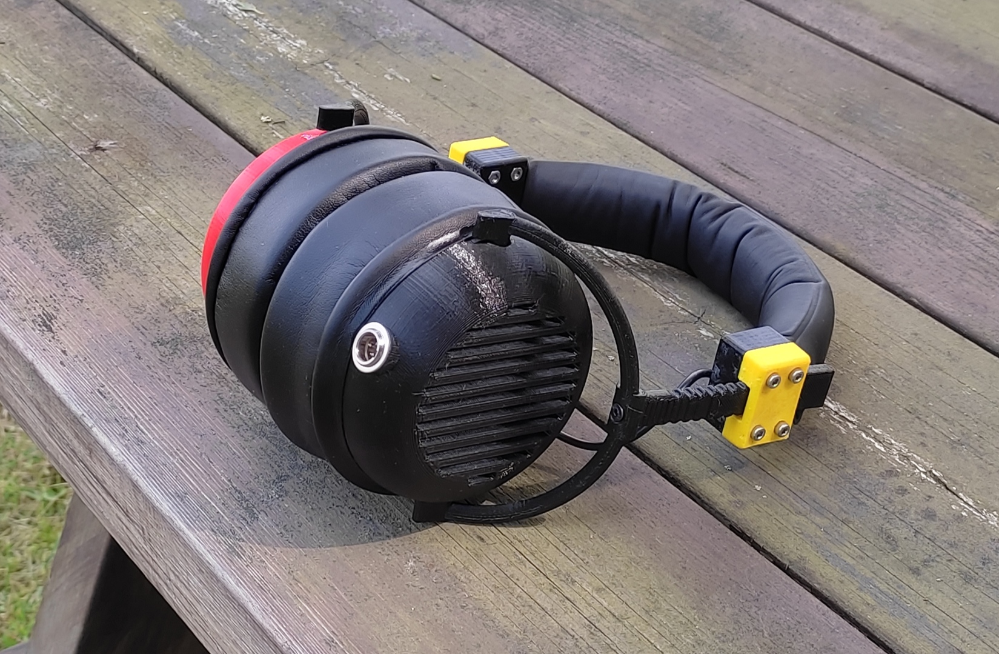
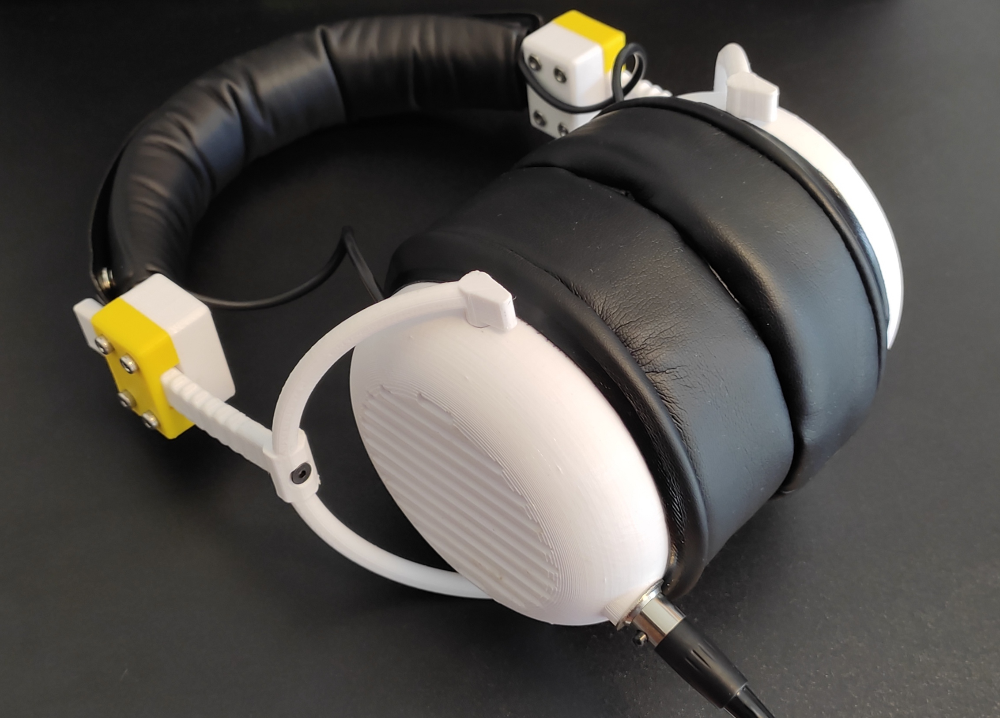

# 3D printable headphones

Features:
* 3D printable
* 40 mm drivers
* Utilizes Beyerdynamic DT770/DT880/DT990 earpads and headband
* Mini XLR socket
* Open/closed versions of the earcups
* Designed with durability and repairability in mind

### Parts to assemble:
| Count | Part                             | Filament | Notes                                                    |
|:-----:|:--------------------------------:|:--------:|:--------------------------------------------------------:|
| 1     | earcup                           | Hard*    | Houses the driver.                                       |
| 1     | earcup_xlr                       | Hard*    | Houses the driver and the mini XLR socket.               |
| 2     | driver_plate                     | Hard*    | Holds the driver. Inserted into earcup.                  |
| 2     | driver_plate_ring                | Hard*    | Holds the driver_plate in place in the earcup.           |
| 4     | driver_bracket                   | Soft**   | Holds down the driver to the driver_plate.               |
| 2     | driver_gasket                    | Hard*    | Gasket for the driver. Inserted into driver_plate.       |
| 2     | earcup_band                      | Hard*    | Goes around the earcup.                                  |
| 1     | headband                         | Hard*    |                                                          |
| 2     | slider_part_1                    | Hard*    | Part 1 of the slider mechanism.                          |
| 2     | slider_part_2                    | Soft**   | Part 2 of the slider mechanism.                          |
| 2     | slider_rod                       | Hard*    | Slides into the slider part 1 + part 2.                  |
| 2     | 40 mm driver                     |          | Inserted into driver_plate.                              |
| 1     | Mini XLR cable                   |          |                                                          |
| 1     | Mini XLR socket                  |          | Mounts to earcup_xlr. Mounting hole diameter is 11.4 mm. |
| 1     | 3-4 mm wire                      |          | 2 wires inside. Connects the earcups/drivers.            |
| 2     | DT-series earpads                |          | Attaches to the earcups.                                 |
| 1     | DT-series headband               |          | Attaches to the headband.                                |
| 8     | M3 insert                        |          | Heated and inserted into driver_plate.                   |
| 8     | M3 nut                           |          | Inserted into slider_part_1.                             |
| 8     | 25mm? M3 screw                   |          | Screws for the slider mechanism.                         |
| 8     | 4mm M3 screw                     |          | Screws the driver_bracket to driver_plate.               |
| 2     | 10mm M3 screw                    |          | Screws the slider_rod to earcup_band.                    |
| 2     | 73mm diameter felt fabric circle |          | Optional: used for tuning the sound of the open earcups. |

\* Filaments such as PLA, PETG etc.

\** Filaments such as TPU, TPC, TPA etc.

### Notes
* Mirror the parts depending on your setup (cable on left/right earcup etc).
* Use as small and narrow M3 inserts as possible, some of the cheaper/wider ones may not fit.
* Use countersunk screws.

